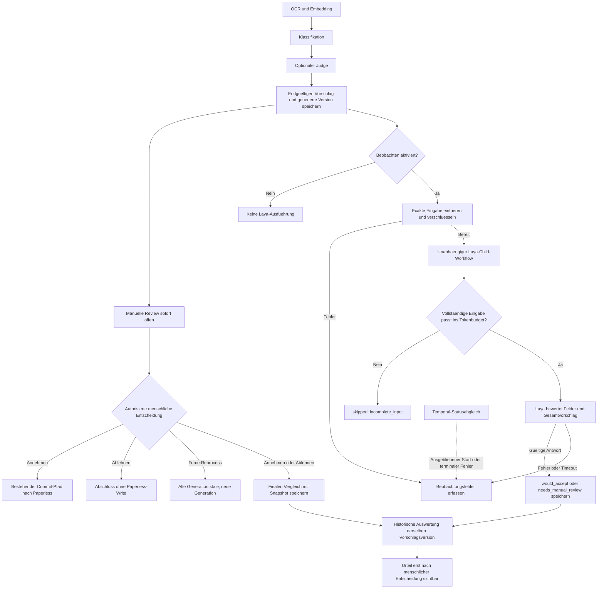

# Implementierungsplan: optionaler Laya-Beobachtungsmodus

Stand: 2026-09-24. **Geplant, nicht implementiert; keine Automatik aktiviert.**

Dieser Plan konsolidiert den abgestimmten Beobachtungsmodus und die Ergänzungen aus der Planprüfung. Er ist ein Implementierungsauftrag für Beobachtung, keine Freigabe automatischer Annahmen. Grundlage der Pfadprüfung: Repository-Stand a012ae94546543b35d8c1eea93de7833f8c318bc.

## Ziel und Grenzen

Laya ist die letzte automatische Bewertungsstufe nach Veröffentlichung des endgültigen Klassifikations-/Judge-Vorschlags. Die Frage lautet: **Kann genau dieser vollständige Vorschlag unverändert angenommen werden?**

Es gibt ausschließlich **Aus** und **Beobachten**, standardmäßig **Aus**. Alle Vorschläge bleiben manuell prüfbar. Laya verändert keine Vorschläge, sendet keine Review-Entscheidungen, erzeugt keine Commit-Aufträge und schreibt nicht nach Paperless. Menschliche Review und Commit dürfen weder vom Start noch vom Ergebnis der Beobachtung abhängen.

[ADR-0018](decisions/0018-suspend-model-confidence-auto-commit.md) bleibt unverändert. Die Freigaberegeln des [Automatisierungsentwurfs](architecture/safe-automation-design.md) betreffen eine spätere automatische Annahme. Training, Fine-Tuning, automatische Annahme und positive Urteile auf gekürzten Eingaben sind nicht Teil dieses Ausbaus.

Die produktive Dokumentverarbeitung bleibt unter einer stabilen Workflow-ID gemäß [ADR-0024](decisions/0024-own-the-complete-document-lifecycle-in-one-temporal-workflow.md). Der zusätzliche Workflow sammelt ausschließlich historische Beobachtungen. Vor seiner Implementierung ist diese Abgrenzung einschließlich privatem Laya-Dienst, Datenzugriff und Ressourcenisolation in den relevanten Architektur- und [Trust-Boundary-Dokumenten](governance/trust-boundaries.md) festzuhalten.

## Ablauf

Der Beobachtungspfad hat **keine Kante zum Annahme- oder Commit-Pfad**. Fehler und unvollständige Eingaben betreffen nur die Beobachtung. Ein altes Ergebnis wird niemals zum Ergebnis einer neuen Vorschlagsversion.

## 1. Publikation, Snapshots und Fehlergrenze

Einhängepunkt ist die bestehende Publikation in [publish_document_review](../app/temporal/document_phase_activities.py), anschließend die Review-Wartephase im [DocumentWorkflow](../app/temporal/workflows.py). [store_review_suggestion](../app/jobs/review_suggestions.py) und menschliche Edits können die aktuelle Vorschlagszeile verändern; diese ist deshalb keine unveränderliche Bewertungsgrundlage.

### Generierte Version

Beim Speichern des Vorschlags wird dessen generierte Version atomar festgehalten: Vorschlags-ID, Pipeline-Generation, Dokument-ID, Paperless-Version und Checksumme, Originalmetadaten, generierte Zielfelder, aufgelöste Entity-IDs sowie kanonischer tatsächlich wirksamer Diff.

Der Snapshot wird nie überschrieben. Wiederholungen derselben Publikation verwenden die bereits gespeicherte Version. Ein abweichender Vorschlag unter derselben Publikationsidentität ist ein expliziter Konflikt, kein stiller Upsert. Die Retry-Strategie muss vermeiden, dass erneutes Lesen veränderter Quellen denselben Snapshot unbemerkt umdeutet. Menschliche Edits referenzieren weiterhin die ursprüngliche generierte Version.

### Exakte Bewertungseingabe

Eine getrennte Eingabe enthält die tatsächlich an Laya übergebenen kanonischen Anfragebytes: vollständigen effektiven Dokumenttext einschließlich verwendeter lokaler OCR-Korrektur, Metadaten, Vorschlag, Feldnamen und Entity-Bezeichnungen, Fragen/Kriterien sowie genau die verwendeten bestätigten Vergleichsdaten.

Vergleichsdaten stammen ausschließlich aus den bereits ausgewählten vertrauenswürdigen Dokumenten. Dokumentversion, Vertrauensstatus und verwendete bestätigte Feldwerte werden eingefroren. Die derzeitigen Kontextreferenzen mit ID, Titel und Distanz allein reichen dafür nicht. Fehlende erwartete Quellen oder Identitäten ergeben eine unvollständige Eingabe. Inferenz und Retries lesen ausschließlich den gespeicherten Snapshot, niemals nachträgliche menschliche Änderungen oder aktuelle Vergleichsdaten.

### Beobachtung darf Publikation nicht blockieren

Die atomare Kernpublikation von Vorschlag und generierter Version ist von optionalem Kontextnachladen, Laya-Anfrageaufbereitung, Verschlüsselung, Beobachtungsspeicherung und Workflow-Start zu trennen. Keine dieser optionalen Operationen darf den veröffentlichten Vorschlag zurückrollen oder seine menschliche Bearbeitung verhindern.

Bereits in der Verarbeitung vorhandene Evidenz wird zur Eingabevorbereitung wiederverwendet. Zusätzlich notwendige Quellenzugriffe sind begrenzt und versionsgeprüft; fehlgeschlagene Vorbereitung führt zu error oder skipped, niemals zu positivem Urteil. Sobald der Kernvorschlag publiziert ist, darf der produktive Review-Pfad nicht auf diese Vorbereitung warten. Das konkrete Übergabeformat zwischen Publikation und Beobachtung ist im ersten Umsetzungsschritt festzulegen: vorhandene versionierte Artefakte bevorzugen; keine Rekonstruktion aus inzwischen veränderten Quellen.

Ein beobachtungsspezifischer Speicher-/Verschlüsselungsfehler wird isoliert behandelt. Ist Fehlerpersistenz selbst nicht verfügbar, bleibt die Review nutzbar; der fehlende Beobachtungsdatensatz wird später über einen unabhängigen Statusabgleich erkennbar gemacht. Fehler-Injektionstests müssen diese Grenze belegen.

## 2. Speicherung und Datenschutz

Vorgesehen sind vier logisch getrennte Tabellen beziehungsweise äquivalente Erweiterungen vorhandener Strukturen:

| Datensatz | Inhalt |
| --- | --- |
| review_proposal_snapshots | Unveränderliche generierte Version, Original-/Zielwerte, wirksamer Diff, Quellidentität und Hash |
| laya_observation_inputs | Komprimierte, anwendungsseitig verschlüsselte exakte Anfrage mit Eingabe-, Tokenizer- und Serialisierungsversion |
| laya_observations | Snapshot-Referenz; queued/running/completed/error/skipped; optionales Urteil, Feldurteile, Grundcodes, Modell-/Checkpoint-/Fragen-/Konfigurationsrevision, Zeiten und Laufzeit |
| review_decision_comparisons | Ursprüngliche Snapshot-Referenz, endgültiger angenommener Diff, menschliche Entscheidung, edited_ever, Änderungsart; Commit-Status getrennt |

Ein eindeutiger Schlüssel aus Snapshot und vollständiger Bewertungsrevision macht Starts, Activity-Retries und Ergebnisspeicherung idempotent. Die Bewertungsrevision umfasst Modell, Tokenizer, Fragen, Serialisierung und Entscheidungsregel. Ein Wiederholungsversuch darf keine zweite Auswertungseinheit erzeugen.

Temporal-Argumente und -Historien enthalten nur Referenzen, Hashes und Status; keine Dokumenttexte oder vollständigen Anfragen. Entschlüsselung ist auf den Beobachtungs-Worker und explizit berechtigten Audit-Zugriff begrenzt. Rohdaten gehören nicht in normale UI-Antworten, Logs oder Metriken. Schlüsselverwaltung und Zugriffsgrenzen sind mit vorhandenen Repository-Konventionen abzustimmen.

Aufbewahrungsvorschlag: während offener Review und 90 Tage nach deren Abschluss; danach Eingaben löschen und nur erforderliche Ergebnis-/Versionsmetadaten behalten. Für stale/überholte oder dauerhaft offene Fälle ist ebenfalls eine begrenzte Aufbewahrungsregel festzulegen. Diese Vorschläge vor Aktivierung mit der tatsächlichen Aufbewahrungsregel abgleichen. Nach Löschung vollständige Rekonstruktion ausdrücklich als nicht mehr verfügbar kennzeichnen.

## 3. Bewertungsvertrag

Der erste Ausbau bewertet alle tatsächlich wirksamen Änderungen: Titel, Datum, Korrespondent, Dokumenttyp, zulässiges erstmaliges Setzen eines Speicherpfads und hinzuzufügende Tags. Unveränderte Felder sind keine Änderungen; ein belegter Speicherpfad bleibt geschützt. Unaufgelöste Entitäten und mehrdeutige Null-Werte sind unvollständige Eingaben.

Versionierte choice-Fragen mit neutralen Optionsschlüsseln und deutschen Kriterien bewerten jedes geänderte Feld sowie den Gesamtvorschlag. Klassifikations-/Judge-Confidence und deren Begründungen werden nicht als Richtigkeitsbelege übergeben. Angezeigte Gründe sind nachvollziehbare Anwendungscodes, keine erfundene freie Laya-Begründung.

**would_accept** ist ausschließlich eine Beobachtung und erfordert:

1. Vollständigen, nicht leeren effektiven Text; keine Kürzung zwischen eingefrorener Quelle und tatsächlich verarbeitetem Modellinput.
2. Alle erforderlichen Original-/Zielfelder und vollständigen wirksamen Änderungssatz.
3. Vollständige, versionsidentifizierte und vertrauenswürdige erwartete Vergleichsdaten; eine fehlende erwartete Vergleichsmenge ist nicht positiv bewertbar.
4. Nachweis mittels gepinntem Tokenizer, dass Fragen, Optionen und State in die jeweiligen Budgets passen, einschließlich der internen Laya-Aufbereitung. Keine stille interne Kürzung.
5. Gültige positive Urteile für jedes geänderte Feld und den Gesamtvorschlag.

Vollständige, negativ bewertete Vorschläge ergeben **needs_manual_review**. Verletzte Vollständigkeit ergibt **skipped/incomplete_input**, technische Fehler **error**. Diese Ausführungszustände sind vom Urteil getrennt. Kein Fallback erzeugt Zustimmung.

Für deutsche Dokumente ist ein gepinnter mehrsprachiger Checkpoint vorgesehen. Deutsch, Umlaute, Mischsprachen, OCR-Schäden, Optionenreihenfolge und Budgetgrenzen sind mit der konkret gewählten Version zu prüfen. Modellwahrscheinlichkeiten bleiben Messdaten, keine nachgewiesene Zuverlässigkeit. Die enge Vollständigkeitsregel kann geringe Abdeckung erzeugen; dies wird gemessen und nicht durch stilles Abschneiden umgangen.

Referenz: [Laya](https://github.com/NandhaKishorM/laya), insbesondere dokumentierte Kontext- und Kalibrierungsgrenzen. Paket-, Modell-, Tokenizer- und Dienstrevision sind vor Implementierung des Adapters festzulegen.

## 4. Temporal-Lebensdauer und Statusverantwortung

Vorgesehen ist ein begrenzter **LayaObservationWorkflow** als Child mit **ParentClosePolicy.ABANDON** und eindeutiger Identität aus Snapshot und Bewertungsrevision. Er erhält nur Referenzen. Der Parent wartet ausschließlich auf die Startbestätigung, niemals auf Inferenz oder Beobachtungsvorbereitung. Startfehler dürfen nicht in den produktiven Klassifikations-/Review-Fehlerpfad gelangen. Die Einführung benötigt Replay-/Versionierungstests für vorhandene DocumentWorkflow-Historien.

| Ereignis | Verhalten |
| --- | --- |
| Mensch nimmt an/lehnt ab | Bestehende Entscheidung und produktiver Abschluss laufen unabhängig weiter; Laya darf innerhalb seines Zeitlimits historisch abschließen |
| Parent-Abschluss/-Abbruch | Beobachtung darf gemäß ABANDON begrenzt weiterlaufen; Parent-Status bleibt unabhängige Kontextinformation |
| Force-Reprocess / Continue-As-New | Alter Vorschlag wird stale, altes Ergebnis bleibt alter Generation zugeordnet; neue Generation erhält neuen Snapshot |
| Activity-Fehler | Nur begrenzte technische Retries; Child persistiert terminalen Fehler idempotent |
| Child-Timeout/-Termination oder dauerhaft fehlender Worker | Unabhängiger Temporal-Statusabgleich projiziert den tatsächlichen terminalen Zustand; keine Verantwortung beim bereits beendeten Child |
| Ausgebliebener Start | Startabsicht und Deadline identifizieren fehlenden Start; Abgleich unterscheidet fehlende Bestätigung von tatsächlich laufendem Workflow |

Der unabhängige Abgleich gehört in einen Temporal-eigenen Wartungs-/Beobachtungsmechanismus auf einer vom Laya-Inferenzworker unabhängigen Queue. Er verwaltet ausschließlich Beobachtungsprojektionen, übernimmt keine produktive Dokument-Recovery und startet keine zweite Ausführungsinstanz auf Verdacht. Temporal bleibt Ausführungsautorität.

Bei unerreichbarem Temporal wird ein Status als unverifiziert/veraltet gekennzeichnet; aus fehlender Erreichbarkeit wird kein erfolgreicher Abschluss und kein erfundener Timeout abgeleitet. Nach Wiederkehr erfolgt der Abgleich. Schreibkonflikte zwischen später Inferenz und terminaler Fehlerprojektion brauchen eine eindeutige Zustandsregel und Compare-and-Set-Tests.

Dienstaufruf, Queue-Wartezeit, Retries und Workflow-Gesamtdauer werden begrenzt. Kein Import-/Aufrufpfad aus Laya-Activities führt zu Review-Signalen, Commit-Intents oder Paperless-Mutationsmethoden.

## 5. Menschlicher Vergleich und verblindete Anzeige

Die bestehende gesperrte Entscheidungs-Transaktion in [ReviewSuggestionController](../laravel/app/Http/Controllers/ReviewSuggestionController.php) hält die finale Entscheidung für genau die generierte Version fest. Snapshot-ID, Vorschlags-ID, Generation und aktueller Status werden unter Lock geprüft.

| Ergebnis | Definition |
| --- | --- |
| accepted_unchanged | Finaler wirksamer Vorschlag entspricht dem generierten Snapshot, auch wenn Zwischen-Edits zurückgenommen wurden |
| accepted_edited | Mindestens ein endgültig angenommener wirksamer Wert weicht ab |
| rejected | Ablehnung derselben Vorschlagsversion |
| pending / stale | Kein bestätigtes menschliches Ergebnis |
| edited_ever | Separates Merkmal zwischenzeitlicher Bearbeitung; verändert accepted_unchanged nicht |
| commit_status | Separater Erfolg/Misserfolg des autorisierten Paperless-Commits |

Sachliche und redaktionelle Änderungen werden nur durch menschlichen Grund oder spätere Adjudikation getrennt; ansonsten **Art unbekannt**. Speichern eines Zwischenstands ist keine finale Entscheidung.

Vor accepted/rejected zeigt die [Review-Seite](../laravel/resources/js/pages/review/Show.svelte) ausschließlich neutralen Ausführungsstatus. **Backend/API/Inertia-Projektionen dürfen Urteil, Feldbewertungen, Wahrscheinlichkeiten oder wertende Gründe vorher gar nicht ausliefern.** Frontend-Ausblenden reicht nicht. Filter, Zähler und Exporte dürfen die Verblindung ebenfalls nicht umgehen.

Nach Entscheidung werden Ergebnisse derselben Version als historische Beobachtung sichtbar, auch bei späterem Eintreffen. Ein stale Vorschlag erhält keine aktuelle Empfehlung. Zugriff folgt weiterhin Dokumentberechtigungen; keine neue Annahme-Aktion.

## 6. Kennzahlen und Nenner

Auswertung verwendet vorab festgelegte Kohorten nach Erzeugungszeit der Vorschlagsversion und einen benannten Auswertungsstichtag. Ein Snapshot zählt je Bewertungsrevision einmal. Offene, stale und nicht eindeutig zuordenbare Fälle bleiben separat sichtbar.

| Kennzahl | Zähler / Nenner |
| --- | --- |
| Beobachtungsabdeckung | completed / alle erzeugten Snapshots im Beobachtungsmodus; error, skipped und ausstehend zusätzlich getrennt |
| Potenziell eingesparte Review-Arbeit insgesamt | Rechtzeitig would_accept und später accepted_unchanged / **alle menschlich entschiedenen Snapshots im Beobachtungsmodus**, einschließlich Beobachtungsfehlern und Skips |
| Potenzial innerhalb bewertbarer Fälle | Derselbe Zähler / alle menschlich entschiedenen Snapshots mit rechtzeitig gültigem Urteil; ausdrücklich bedingte Zusatzquote |
| Korrektur-/Ablehnungsanteil | would_accept und später accepted_edited oder rejected / alle would_accept mit abgeschlossener menschlicher Entscheidung |
| Commit-Erfolg | Erfolgreiche Commits / angenommene Vorschläge mit bekanntem Commit-Ausgang; ausstehende separat |

**Rechtzeitig** bedeutet: terminales gültiges Laya-Ergebnis lag vor der finalen menschlichen Entscheidung vor. Nachträgliche Ergebnisse werden als completed_after_review ausgewiesen und nur in einer getrennten rückblickenden Gegenüberstellung verwendet. Zeitbasis und Gleichstandsregel müssen konsistent definiert werden.

Immer Rohzahlen und Nenner berichten. Korrekturarten sowie Sprache, Dokumentart und Feldkombination getrennt ausweisen; kleine Zellen nicht überinterpretieren. Unbekannte Edit-Art wird in der Hauptkorrekturquote konservativ mitgezählt. Keine Quote wird als Beleg bereits freigegebener automatischer Schreibzugriffe dargestellt.

## 7. Betrieb und Konfiguration

Empfohlen ist ein privater lokaler Dienst mit dauerhaft geladenem mehrsprachigem Modell, gepinnten Versionen, Healthcheck und begrenzter Parallelität. Er isoliert Modellabhängigkeiten vom produktiven Worker. Der Laya-Inferenzpfad erhält begrenzte eigene Kapazität; er darf nicht die gemeinsame produktive Modellkapazität blockieren.

Modellbeschaffung und Kaltstart erfolgen vor Aktivierung, nicht beim Dokumentaufruf. CPU/RAM beziehungsweise GPU/VRAM und reale Laufzeiten auf Zielhardware messen. Der [Laya-HTTP-Endpunkt](https://github.com/NandhaKishorM/laya#self-hosting-http-server-jev-compatible) ist ein Adapterkandidat, kein ungeprüfter Laufzeitvertrag.

Aus/Beobachten wird über bestehende Settings, Python-Konfigurationsexport und eingefrorene Laufkonfiguration geführt. Kein Auto-Accept-Schalter. Aus verhindert neue Beobachtungen; bereits laufende Beobachtungen dürfen innerhalb ihres Budgets enden. Ein gesonderter operativer Abbruch darf nur Beobachtung betreffen.

## 8. Umsetzung in kleinen Schritten

- [ ] **Snapshot-Vertrag und Fehlergrenze:** kanonischen Diff, generierte Version, Evidenzübergabe und Verschlüsselung festlegen; Kernpublikation gegen optionale Fehler isolieren. Migrationen, Vorschlagspersistenz und Review-Versionsreferenz.
- [ ] **Bewertungsadapter:** gepinnte Anfrage-/Fragen-/Tokenizer-Verträge, vollständige Eingaben, strikte Antwortvalidierung und idempotente Speicherung. Keine Laya-Annahme-/Commit-Abhängigkeit.
- [ ] **Temporal-Beobachtung:** Child, Startidentität, begrenzte Activity, eigenständiger Statusabgleich, Zustandsübergänge und Replay-Kompatibilität.
- [ ] **Menschlicher Vergleich:** finalen Diff in Entscheidungs-Transaktion speichern; Zwischen-Edits, Ablehnung, stale und Commit-Ausgang getrennt.
- [ ] **Settings und Anzeige:** Default Aus; neutrale Statusprojektion vor Entscheidung serverseitig erzwingen; historische Anzeige danach.
- [ ] **Auswertung:** vollständige und bedingte Nenner, zeitliche Verfügbarkeit, Versionstreue und Fehler-/Skip-Abdeckung.
- [ ] **Betrieb und Dokumentation:** Ressourcenbudget, Versionierung, Aufbewahrung, Trust Boundaries, Supply-Chain-Prüfungen und Betriebsanleitung.

Wesentliche bestehende Ansatzpunkte: [Publikation](../app/temporal/document_phase_activities.py), [Workflows](../app/temporal/workflows.py), [Contracts](../app/temporal/contracts.py), [Worker](../app/temporal/worker.py), [Vorschlagspersistenz](../app/jobs/review_suggestions.py), [Review-Modell](../laravel/app/Models/ReviewSuggestion.php), [Controller](../laravel/app/Http/Controllers/ReviewSuggestionController.php), [SettingsCatalog](../laravel/app/Services/Settings/SettingsCatalog.php), [PythonRuntimeConfigExporter](../laravel/app/Services/Settings/PythonRuntimeConfigExporter.php), [Konfigurationssnapshot](../app/temporal/phase_activities.py). Neue Module erst nach Prüfung auf bestehende passende Strukturen.

## 9. Abnahmekriterien und Tests

- [ ] Positive Urteile, Retries, Fehler und verspätete Ergebnisse erzeugen **keine** Review-Signale, Commit-Aufträge oder Paperless-PATCHes; verbotene Sinks und Aufruf-/Importgrenzen prüfen.
- [ ] Fehler beim Vergleichsdatenzugriff, Verschlüsseln, Speichern oder Starten blockieren weder Vorschlagspublikation noch manuelle Annahme/Ablehnung.
- [ ] Snapshot-Retry überschreibt keine Version; konkurrierende Edits, veränderte Quellen, doppelte Starts und Force-Reprocess sind versionssicher.
- [ ] Leere, beschädigte, überlange, intern gekürzte oder unvollständige Inputs erzeugen niemals would_accept; echte Tokenizer-Grenzen mit gepinntem Modell prüfen.
- [ ] Annahme/Ablehnung während Inferenz, Parent-Ende, Continue-As-New, Child-Timeout, fehlender Worker und Statusabgleich haben definierte, getestete Zustände.
- [ ] Vorentscheidungsergebnisse fehlen in tatsächlichen API-/Inertia-Antworten und indirekten Filtern; Berechtigungen gelten auch historisch.
- [ ] Zurückgenommene Edits zählen als accepted_unchanged; offene/stale/fremde Versionen sind kein bestätigtes Label; fehlgeschlagener Commit ändert das menschliche Label nicht.
- [ ] Gesamtquote enthält entschiedene Fehler-/Skip-Fälle im Nenner; späte Ergebnisse erhöhen nicht die rechtzeitig eingesparte Arbeit.
- [ ] Aus startet nichts; ein Beobachtungs-Ausfall lässt den normalen Lifecycle funktionsfähig.
- [ ] Aufbewahrung, Löschung, Zugriff und fehlende Rekonstruierbarkeit sind getestet und dokumentiert.

Für die Implementierung gelten die [Repository-Prüfungen](agent/CHECKS.md): gezielte Python-/Laravel-/UI- und Temporal-Replay-Tests; bei Abhängigkeits-/Containeränderungen zusätzlich deren Supply-Chain-/Build-Prüfungen. Dieser Dokumentationsplan implementiert noch keinen dieser Schritte.

## 10. Vor Aktivierung festzulegen

- Zielhardware und zulässiges CPU/RAM- beziehungsweise GPU/VRAM-Budget.
- Konkrete Modell-, Tokenizer-, Paket- und Dienstrevision sowie gemessene Laufzeitgrenzen.
- Aufbewahrung für abgeschlossene, stale und dauerhaft offene Reviews.
- Abgrenzung des Beobachtungs-Childs und der neuen Datengrenzen in der Architektur.

Eine spätere automatische Annahme benötigt einen gesonderten Plan auf Basis der Beobachtungsdaten und der bestehenden Architekturentscheidungen.
